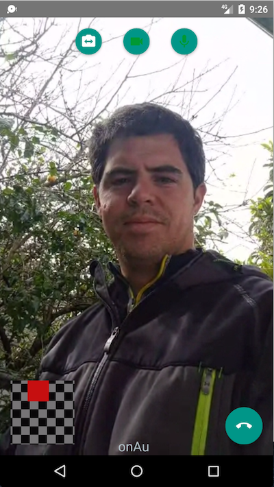

Twilio Video SDK React Native Wrapper
--

###Currently Android Only
There is an iOS only project that can be found here:
https://github.com/gaston23/react-native-twilio-video-webrtc

##Installation
**TODO**: Currently it is not being distributed via npm. So you would need to import the `android/library` module and copy/paste the `TwilioVideoView` into your project.

##Running Sample
1) Clone this repo.
2) Install dependencies. I use Yarn, so you can do `yarn` in the directory. Or use NPM and run `npm i`.
3) Generate an access token as described [here](https://github.com/twilio/video-quickstart-android#quickstart).
4) Set the access token in `index.android.js`.
5) Run `react-native run-android` with an emulator or device connected.

Probably a good idea to read the [docs](https://www.twilio.com/docs/api/video/getting-started).

##Permissions
The library project declares the following permissions, which **will be merged** into your `AndroidManifest.xml`:

```xml
<manifest>
    <uses-feature android:name="android.hardware.camera"/>
    <uses-feature android:name="android.hardware.camera.autofocus"/>
    <uses-feature
        android:glEsVersion="0x00020000"
        android:required="true"/>
    
    <uses-permission android:name="android.permission.CAMERA"/>
    <uses-permission android:name="android.permission.INTERNET"/>
    <uses-permission android:name="android.permission.RECORD_AUDIO"/>
    <uses-permission android:name="android.permission.MODIFY_AUDIO_SETTINGS"/>
    <uses-permission android:name="android.permission.ACCESS_NETWORK_STATE"/><uses-permission android:name="android.permission.ACCESS_WIFI_STATE"/>
    
    ...
</manifest>
```
##Usage


##Screenshot


